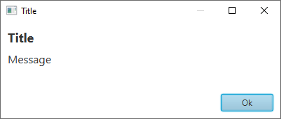
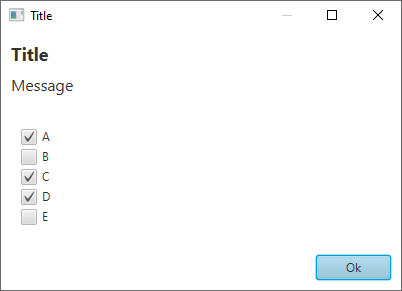
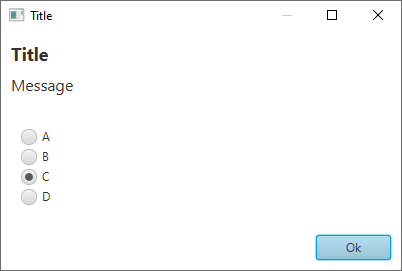
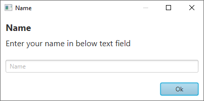
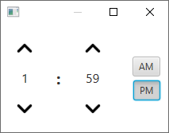
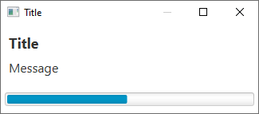
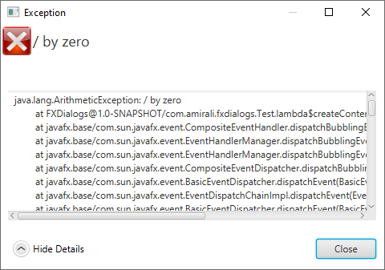

## FXDialogs

This is a library to create AlertDialog , ProgressDialog and etc...

### Examples

<details>
<summary>AlertDialog</summary>

```java
var alert = new AlertDialog.Builder()
        .setTitle("Title")
        .setMessage("Message")
        .setPositiveButton("Ok", System.out::println)
        .create();
alert.initModality(Modality.APPLICATION_MODAL);
alert.show();
```


</details>

<details>
<summary>MultiChoiceAlertDialog</summary>

```java
var alert = new AlertDialog.Builder()
        .setTitle("Title")
        .setMessage("Message")
        .setPositiveButton("Ok", System.out::println)
        .setMultiChoiceItems(new String[]{"A","B","C","D","E"}, new Integer[]{0,2,3}, (which, isChecked) -> {
            if (isChecked)
                System.out.println(which + " checked");
            })
        .create();
alert.initModality(Modality.APPLICATION_MODAL);
alert.show();
```


</details>

<details>
<summary>SingleChoiceAlertDialog</summary>

```java
var alert = new AlertDialog.Builder()
        .setTitle("Title")
        .setMessage("Message")
        .setPositiveButton("Ok", System.out::println)
        .setSingleChoiceItems(new String[]{"A","B","C","D"}, 2, which -> System.out.println(which + "checked"))
        .create(); 
alert.initModality(Modality.APPLICATION_MODAL);
alert.show();
```


</details>

<details>
<summary>CustomAlertDialog</summary>

```java
var customNodeContainer = new HBox();
customNodeContainer.setPadding(new Insets(10));
var textField = new TextField();
HBox.setHgrow(textField, Priority.ALWAYS);
textField.setPromptText("Name");   
                       
customNodeContainer.getChildren().add(textField);

var alert = new AlertDialog.Builder()
        .setTitle("Name")
        .setMessage("Enter your name in below text field")
        .setPositiveButton("Ok", which -> System.out.println(textField.getText()))
        .setNode(customNodeContainer)
        .create();
alert.initModality(Modality.APPLICATION_MODAL);
alert.show();
```


</details>

<details>
<summary>AlertDialogWithSound</summary>

```java
var alert = new AlertDialog.Builder()   
        .setTitle("DialogWithSound")
        .setMessage("The sound will be play when dialog shown")
        .setPositiveButton("Ok", System.out::println)
        .setSound(Sounds.ChimesGlassy)
        .create();
alert.initModality(Modality.APPLICATION_MODAL);
alert.show();
```

Note : you should add javafx.media dependency when you want to use sounds
</details>


<details>
<summary>TimePickerDialog</summary>

```java
var timePickerDialog = new TimePickerDialog.Builder(time -> System.out.println(time.toString()))
        .create();
timePickerDialog.initModality(Modality.APPLICATION_MODAL);
timePickerDialog.show();
```


</details>

<details>
<summary>ProgressDialog</summary>

```java
var progressDialog = new ProgressDialog.Builder()
        .setTitle("Title")
        .setMessage("Message")
        .setProgressBar(ProgressDialog.ProgressBarType.Bar)
        .create();
progressDialog.initModality(Modality.APPLICATION_MODAL);
progressDialog.show();

progressDialog.setProgress(.5);
```


</details>

<details>
<summary>ExceptionDialog</summary>

```java
try {
    System.out.println(20/0);
}catch (ArithmeticException e) {
    var exceptionDialog = new ExceptionDialog.Builder()
            .setMessage(e.getMessage())
            .setException(e)
            .create();
    exceptionDialog.show();
}
```


</details>


### Styling

You can use `.setStyles(String... styles)` to add custom css styles to dialog

example :

```
.root {
    -fx-background-color : white;
}

#title {
    -fx-font-size : 18px;
    -fx-font-weight : bold;
}

#message {
    -fx-font-size : 16px;
}
```