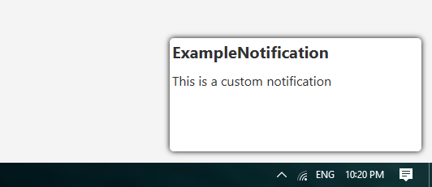

## FXDialogs

<br>
<div align=center>
  
  <br>
  <a href="https://amirali-az.github.io/FXDialogsWebsite/">FXDialogs</a>
</div>

### What is this?

This is a library to create AlertDialog , ProgressDialog and etc...

### Examples

> Click ▶️ or 🔽 to expand or collapse examples

<details>
<summary>AlertDialog</summary>

<p>

```java
var alert = new AlertDialog.Builder()
        .setDialogTitle("Title")
        .setDialogMessage("Message")
        .setPositiveButton("Ok", System.out::println)
        .create();
alert.setTitle(alert.getDialogTitle());
alert.show();
```
</p>


</details>

<details>
<summary>MultiChoiceAlertDialog</summary>

<p>

```java
var alert = new AlertDialog.Builder()
        .setDialogTitle("Title")
        .setDialogMessage("Message")
        .setPositiveButton("Ok", System.out::println)
        .setMultiChoiceItems(new String[]{"A","B","C","D","E"}, new Integer[]{0,2,3}, (which, isChecked) -> {
            if (isChecked)
                System.out.println(which + " checked");
            })
        .create();
alert.setTitle(alert.getDialogTitle());
alert.show();
```
</p>


</details>

<details>
<summary>SingleChoiceAlertDialog</summary>

<p>

```java
var alert = new AlertDialog.Builder()
        .setDialogTitle("Title")
        .setDialogMessage("Message")
        .setPositiveButton("Ok", System.out::println)
        .setSingleChoiceItems(new String[]{"A","B","C","D"}, 2, which -> System.out.println(which + "checked"))
        .create();
alert.setTitle(alert.getDialogTitle());
alert.show();
```
</p>


</details>

<details>
<summary>CustomAlertDialog</summary>

<p>

```java
var customNodeContainer = new HBox();
customNodeContainer.setPadding(new Insets(10));
var textField = new TextField();
HBox.setHgrow(textField, Priority.ALWAYS);
textField.setPromptText("Name");   
                       
customNodeContainer.getChildren().add(textField);

var alert = new AlertDialog.Builder()
        .setDialogTitle("Name")
        .setDialogMessage("Enter your name in below text field")
        .setPositiveButton("Ok", which -> System.out.println(textField.getText()))
        .setNode(customNodeContainer)
        .create();
alert.setTitle(alert.getDialogTitle());
alert.show();
```
</p>


</details>

<details>
<summary>AlertDialogWithSound</summary>

<p>

```java
var alert = new AlertDialog.Builder()   
        .setDialogTitle("DialogWithSound")
        .setDialogMessage("The sound will be play when dialog shown")
        .setPositiveButton("Ok", System.out::println)
        .setSound(Sounds.ChimesGlassy)
        .create();
alert.setTitle(alert.getDialogTitle());
alert.show();
```
Note : you should add javafx.media dependency when you want to use sounds

</p>

</details>


<details>
<summary>TimePickerDialog</summary>

<p>

```java
var timePickerDialog = new TimePickerDialog.Builder()
        .create();
timePickerDialog.initModality(Modality.APPLICATION_MODAL);
timePickerDialog.showAndWait();

System.out.println(timePickerDialog.getTime().toString());
```

</p>


</details>

<details>
<summary>ProgressDialog</summary>

<p>

```java
var progressDialog = new ProgressDialog.Builder()
        .setDialogTitle("Title")
        .setDialogMessage("Message")
        .setProgressType(ProgressDialog.ProgressBarType.Bar)
        .setProgress(.5)
        .create();
progressDialog.setTitle(progressDialog.getDialogTitle());
progressDialog.show();
```

</p>


</details>

<details>
<summary>ExceptionDialog</summary>

<p>

```java
try {
    System.out.println(20/0);
}catch (ArithmeticException e) {
    var exceptionDialog = new ExceptionDialog.Builder()
            .setDialogMessage(e.getMessage())
            .setException(e)
            .create();
    exceptionDialog.show();
}
```

</p>


</details>

<details>
<summary>PersistentBottomSheet</summary>

<p>

```java
var root = new BorderPane();

var persistentBottomSheet = new PersistentBottomSheet();
persistentBottomSheet.setPrefHeight(150);
persistentBottomSheet.setStyle("-fx-background-color : orange;");
persistentBottomSheet.setDuration(Duration.seconds(.5));
persistentBottomSheet.dragHandlerImageProperty().set(new Image(Objects.requireNonNull(getClass().getResourceAsStream("round_horizontal_rule_white_24dp.png"))));
persistentBottomSheet.addSupportResizing();

var label = new Label("Bottom Sheet");
label.setStyle("-fx-text-fill : white; -fx-font-size : 18px;");
var bottomSheetContentRoot = new StackPane(label);
bottomSheetContentRoot.setPadding(new Insets(15));

persistentBottomSheet.getChildren().add(bottomSheetContentRoot);

var showButton = new Button("Hide");
showButton.setPrefSize(75, 25);
showButton.setOnAction(event -> {
    persistentBottomSheet.showingProperty().set(!persistentBottomSheet.isShowing());
        if (persistentBottomSheet.isShowing())
            showButton.setText("Hide");
        else
            showButton.setText("Show");
    });

root.setCenter(new StackPane(showButton));
root.setBottom(persistentBottomSheet);
```

BottomSheetCallBack

```java
persistentBottomSheet.setCallBack(new BottomSheetCallBack() {
    @Override
    public void onState(PersistentBottomSheet bottomSheet, int state) {
        switch (state) {
            case PersistentBottomSheet.EXPANDED ->
                    System.out.println("expanded");
            case PersistentBottomSheet.COLLAPSED ->
                    System.out.println("collapsed");
            case PersistentBottomSheet.DRAGGED -> 
                    System.out.println("dragged");
            case PersistentBottomSheet.HIDDEN ->
                    System.out.println("hidden");
            case PersistentBottomSheet.SHOWN ->
                    System.out.println("shown");
        }
    }

    @Override
    public void onResized(PersistentBottomSheet bottomSheet, int percent) {
        System.out.println(percent + "%");
    }
});
```
</p>


</details>

<details>
<summary>SplashScreen</summary>

<p>

```java
import javafx.application.Application;
import javafx.scene.Parent;
import javafx.scene.Scene;
import javafx.scene.control.Label;
import javafx.scene.layout.StackPane;
import javafx.stage.Stage;
import javafx.util.Duration;

public class Main extends Application {

    public static void main(String[] args) {
        launch(args);
    }

    @Override
    public void start(Stage primaryStage) {
        primaryStage.setTitle("SplashScreenDemo");
        primaryStage.setScene(new Scene(createContent(), 600, 400));

        var splashScreen = new SplashScreen.Builder(Duration.seconds(2), primaryStage)
                .setScene(new Scene(createSplashScreenContent(), 600, 400))
                .create();
        splashScreen.show();
    }

    private Parent createSplashScreenContent() {
        var label = new Label("SplashScreenDemo");
        label.setStyle("-fx-font-size: 25px; -fx-font-weight: bold; -fx-text-fill: white;");

        var root = new StackPane(label);
        root.setStyle("-fx-background-color: linear-gradient(to right, #FF508E, #5AC0FF);");

        return root;
    }

    private Parent createContent() {
        var label = new Label("Hello, World");
        label.setStyle("-fx-font-size: 20px;");

        var root = new StackPane(label);
        root.setStyle("-fx-background-color: white;");

        return root;
    }
}
```

</p>


<p>after 2 seconds</p>


</details>

<details>
<summary>PopupNotification</summary>

<p>

- create notification layout (of course you can set controller)

`notification-view.fxml`

```xml
<?xml version="1.0" encoding="UTF-8"?>

<?import javafx.scene.control.Label?>
<?import javafx.scene.layout.AnchorPane?>


<AnchorPane id="root" prefHeight="150.0" prefWidth="320.0" stylesheets="@style.css" xmlns="http://javafx.com/javafx/17" xmlns:fx="http://javafx.com/fxml/1">
   <children>
      <Label id="title" fx:id="title" layoutX="14.0" layoutY="14.0" text="ExampleNotification" AnchorPane.leftAnchor="0.0" AnchorPane.rightAnchor="0.0" AnchorPane.topAnchor="0.0" />
      <Label id="message" fx:id="message" layoutX="8.0" layoutY="46.0" text="This is a custom notification" wrapText="true" AnchorPane.leftAnchor="0.0" AnchorPane.rightAnchor="0.0" />
   </children>
</AnchorPane>
```

- style sheet

`style.css`

```
#root {
    -fx-background-color: white;
    -fx-background-insets: 5;
    -fx-padding: 8;
    -fx-effect: dropshadow(three-pass-box, black, 10, 0, 0, 0);
    -fx-background-radius: 5;
}

#title {
    -fx-font-size: 20px;
    -fx-font-weight: bold;
}

#message {
    -fx-font-size: 16px;
}
```

- create and show the notification

```java
try {
    var loader = new FXMLLoader(getClass().getResource("notification-view.fxml"));

    var notification = new PopupNotification(Duration.seconds(2), ((AnchorPane) loader.load()));
    notification.setSound(Sounds.Succeeded);
    notification.setAutoHide(true);
    notification.show(primaryStage);
}catch (IOException e) {
    e.printStackTrace();
}
```
</p>

<p>result :</p>



</details>

<details>
<summary>TrayIcon</summary>

<p>

```java
if (SystemTray.isSupported()) {
    Platform.setImplicitExit(false);
            
    var menu = new ContextMenu();
    var exitItem = new MenuItem("Exit Application");
    exitItem.setOnAction(event -> {
        Platform.exit();
        System.exit(0);
    });

    menu.getItems().add(exitItem);

    var trayIcon = new FXTrayIcon(
            Toolkit.getDefaultToolkit().getImage(getClass().getResource("fxdialogs.png")),
        "Demo FXTrayIcon",
        menu
    );

    var tray = SystemTray.getSystemTray();
    tray.add(trayIcon);
}
```

</p>

<p>result: </p>


</details>

### Styling

You can use `.setStyles(String... styles)` to add custom css styles to dialog

example :

```
.root {
    -fx-background-color : white;
}

#title {
    -fx-font-size : 18px;
    -fx-font-weight : bold;
}

#message {
    -fx-font-size : 16px;
}
```
